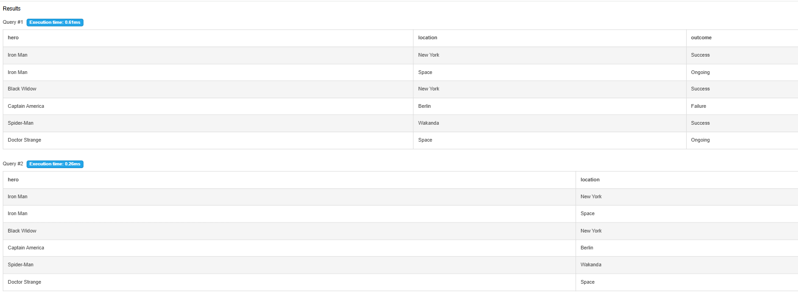

# 🛡️ S.H.I.E.L.D. SQL Database – Hero Deployment & Mission Analytics

This SQL project simulates the operations of **S.H.I.E.L.D.**, a fictional defense agency from the Marvel universe. It tracks **heroes**, **missions**, **villains**, and **threat responses** using a normalized relational database and advanced analytical SQL queries.

---

## 🗺️ Entity-Relationship Diagram

The database design uses **five tables**, including **two junction tables** to manage many-to-many relationships:

---

## 🧱 Database Schema (DDL)

**Tables:**

- `Heroes(hero_id PK, name, power, status)`
- `Villains(villain_id PK, name, threat_level)`
- `Missions(mission_id PK, location, mission_type, outcome)`
- `Hero_Missions(hero_id FK, mission_id FK, role)` – *Many-to-Many*
- `Mission_Villains(mission_id FK, villain_id FK)` – *Many-to-Many*

The schema is normalized for scalability and relational integrity.

---

## 🔢 Sample Data (DML)

The `insert_data.sql` file includes:
- Heroes like **Iron Man**, **Black Widow**, **Spider-Man**
- Villains like **Loki**, **Thanos**
- Missions with various types: **Combat**, **Rescue**, **Recon**
- Role-based mapping of heroes to missions
- Threat-level assignments for villains

---

## 📊 Sample Analytical Queries

From `sample_queries.sql`:
- Mission outcomes and villain involvement
- Top deployed heroes
- High-risk villains and failed missions
- Hero count per mission
- Summary of active and retired heroes

  
  

---

## 🧠 Advanced SQL Logic

From `advanced_queries.sql`:

- ✅ `INNER JOIN`, `LEFT JOIN`, `RIGHT JOIN`, `FULL OUTER JOIN`
- ✅ `CASE` statements for threat analysis
- ✅ CTEs and subqueries for mission and villain counts
- ✅ Window functions for activity tracking
- ✅ Logic to identify flawless heroes

### 🔍 Query Results Preview

  
  
  

---

## 🧪 How to Run This Project

### ✅ Option 1: [DB-Fiddle](https://www.db-fiddle.com/)
1. Paste contents of `schema.sql` and run
2. Paste `insert_data.sql` and run
3. Execute queries from `sample_queries.sql` or `advanced_queries.sql`

### ✅ Option 2: Local MySQL (Workbench / DBeaver)
1. Create a new schema
2. Run files in this order:
   - `schema.sql`
   - `insert_data.sql`
   - Explore queries for insights

---

## 💼 Skills Demonstrated

- Relational Database Design (ERD, Normalization)
- SQL (DDL, DML, Joins, Aggregates, CASE, CTE, Windows)
- Data Modeling & Relationships
- Query Optimization & Realistic Use Cases
- Git & GitHub Version Control
- Professional Documentation

---

## ✨ Final Thoughts

This fictional project is a creative yet professional demonstration of my **SQL capabilities**. It blends superhero-themed storytelling with real-world logic that any data analyst would use to extract insights and drive decisions. Whether it’s assessing mission success rates or managing risk by villain profiles, this database is designed with **analytical thinking** at its core.

> "Good queries are like good heroes — precise, efficient, and always ready for action."
